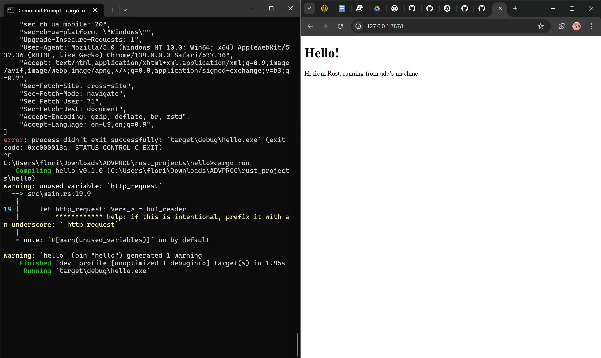
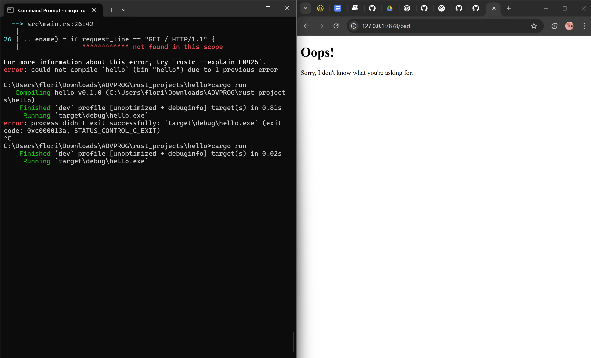
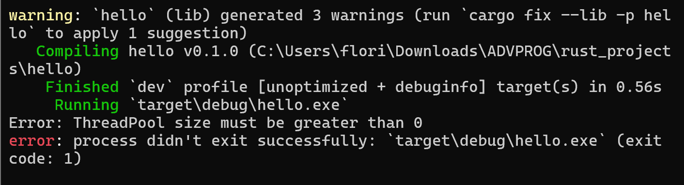

## Commit 1 Reflection
In the handle_connection function, we make a new BufReader instance, which wraps a reference to the stream. It adds buffering, meaning it reads a larger chunk of data into memory at once. http_request collects the lines of the request that the browser sends to our server in a vector. The lines method then splits the stream of data into a String whenever it sees a newline byte, and then each String is mapped to a Result. Because we're slacking on error handling for this one, we just put in unwrap so that if errors show up, we just stop the program. The browser signals the end of a HTTP request by sending two newline characters in a row, so if we get a line that is the empty string, that signifies one request from the stream. After all is done, we print out the result.

## Commit 2 Reflection 

After this round of modifications, we've added fs to import the standard library’s filesystem module. We also added a status_line variable to hold the message's success data. To handle errors, we use unwrap() to stop the program. The variable contents store the results of hello.html read as a string, and the variable length stores the length of contents. Then, we use format! to add the file’s contents as the body of the success response. The as_bytes method is called on the response to convert the string data to bytes. As mentioned in the book, the write_all method on stream takes a '&[u8]' and sends those bytes directly down the connection. Because of this, we are able to see our hello.html webpage when we access the endpoint.

## Commit 3 Reflection 

### Splitting the Response Handling
To do selective responding, we're going to look at the first line of the HTTP request, so isntead of reading the entire request as a vector, we call next to get the first item in the iterator. This is stored into the request_line variable, and if it is a GET request with a / path, then the if block returns the contents of hello.html. If it doesn't, we must have received some other request, so we'll add an else block to direct it into 404.html.

### Refactoring
When looking at the code, it's easy to notice that there's a lot of repetition going on. We can clean up the code by assigning the status line and filename first, then using those variables later. Now the if and else blocks only return the status line and filename, which is assigned to a tuple with the let statement. The resulting code is easier to maintain, because if we have to make any changes, we only have to do it in one place now. 

## Commit 4 Reflection 
In this commit, we're simulating a slow response by making the server sleep for 10 seconds before responding when we access the /sleep endpoint. Now that we have three cases, we switch from if to match. When running the application now, if we access the /sleep endpoint then the / endpoint, the / endpoint waits until /sleep has slept its full 10 seconds before responding. This happens because the server is handling requests sequentially in a single thread. This shows a major issue with single-threaded servers: if one request takes too long, it slows down all other requests, making the server inefficient under heavy traffic.

## Commit 5 Reflection 
This commit makes the website multithreaded by introducing a thread pool, allowing multiple requests to be processed at the same time instead of sequentially. The ThreadPool struct manages a fixed number of worker threads, each waiting for jobs to be assigned through a message passing channel. When a new request comes in, it is sent as a Job to the available worker, which then executes the handle_connection function. Since multiple workers exist, requests like /sleep don't block the entire server since other threads can continue handling incoming requests while one is sleeping.

## Bonus Reflection

In the new build function, we check if the threadpool size is valid before creating worker threads. If the size is 0, it prints an error message and forcefully terminates the program using std::process::exit(1). Above is an example of what would happen if the provided size is set to 0. If the size is valid, build proceeds to create the worker threads just like new, initializing a message-passing channel (mpsc::channel()), wrapping the receiver in an Arc<Mutex\<T>>, and spawning worker threads that listen for incoming jobs. 